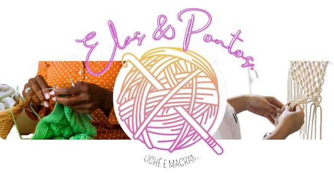

# Projeto-Final_Reprograma

<h1  align="center">

 

</h1>

## Apresentação

### Quem é a Náira Nogueira? 

 

[Náira Nogueira](https://www.instagram.com/naira.nog/), tenho 28 anos, sou formada em Língua Portuguesa pela Universidade do Estado da Bahia, oriunda de uma pequena cidade do interior da Bahia, chamada Governador Mangabeira, conheci a Reprograma através de uma amiga que já tinha feito o curso de Front-End. Buscando estabilidade financeira e um novo objetivo de vida, 
entrei no mundo da Tecnologia sem nunca ter tido contato com o mais simples desenvolvimento de códigos, hoje tenho conhecimentos básicos sobre html, css, JS, React, Git Bash e Github.

#### Contatos

-  [E-mail](naira.nogueira24@gmail.com) 

-  [LinkedIn](https://www.linkedin.com/in/cyberlua7/) // ALTERAR

-  [GitHub](https://github.com/cyberlua) // ALTERAR 

## Conhecendo o projeto (Conexão Bapho) // MUDAR O NOME DO PROJETO PARA O DE VOCÊS

### 🧠 Contexto

// ESCREVA AQUI O CONTEXTO E OBJETIVO DO SEU PROJETO

### O site conterá 4 páginas:

* Home

* Sobre

* Empresas

* Cursos

* Contato

### Todas as páginas terão os componentes:

* Menu

* Header

* Footer

* Slides

* Dark Mode

## Estrutura do projeto

 // COLOCAR O PRINT DA ESTRUTURA DO SEU PROJETO - OPCIONAL BOTAR O PRINT DAS DEPENDENCIAS TAMBÉM. LEMBRAR QUE ESSAS IMAGENS DEVEM FICAR NUMA NOVA PASTA ASSETS FORA DAS PASTAS DO PROJETO. TODAS AS IMAGENS FICAM NESSA PASTA, INCLUSIVE AS PRIMEIRAS LOGO/PERFIL

 

##  `Tecnologias que utilizei` // ADD OU MODIFICAR ALGUMAS TECNOLOGIAS  

| Ferramenta | Descrição |

| `ReactJS` | Framework web |

| `Vite` | Gerador de projeto de front-end |

| `npm` | Gerenciador de pacotes |

| `Firebase` | Ferramenta realtime database para gravar as mensagens de contato |

| `Module CSS` | Ferramenta para ter mais produtividade ao estilizar a aplicação |

| `Phosphor` | Dependência com ícones super legais |

| `React icons` | Outra dependência com ícones legais |

| `React router dom` | Dependência para criar rotas no reactjs |

| `React Bootstrap` | Biblioteca que oferece componentes Bootstrap construído em React |

| `Vercel` | Hospedagem para a aplicação, fiz o deploy integrado com o github |

| `Github` | Hospedagem do código fonte integrado com gerenciador de versionamento |

 

###  `Como rodar o projeto localmente`  // SE VOCÊ NÃO VAI INTEGRAR COM O FIREBASE SO REMOVER AS INFORMAÇÕES DO FIRE BASE NO PASSO A PASSO 

Siga os passos e inclua as informações abaixo:

|&nbsp;&nbsp;&nbsp;&nbsp; Passo &nbsp;&nbsp;&nbsp;&nbsp;&nbsp;| &nbsp;&nbsp;&nbsp;Comando/informação &nbsp;&nbsp;&nbsp;|

| Faça o fork | `botão de forkar` |

| Faça o clone | `git clone` |

| Instale as dependências após acessar a pasta projeto | `npm i` |

| Crie as variáveis de ambiente para integrar com Firebase e inclua os valores da sua conta | `conforme .env.example e lista abaixo`|

| Rode o projeto | `npm run dev` |

**Variáveis de ambiente**

* VITE_API_KEY=

* VITE_AUTH_DOMAIN=

* VITE_PROJECT_ID=

* VITE_STORAGE_BUCKET=

* VITE_MESSAGING_SENDER_ID=

* VITE_APP_ID=

* VITE_DATABASE_URL=

 

## 💪 Desafios 

- Maior desafio desse projeto....

- Outro desafio foi....

// OPCIONAL PARA A DOCUMENTAÇÃO MAS INTERESSANTE PARA APRESENTAÇÃO 

## 💪 Aprendizados

- Meu aprendizado nesse projeto....

- E outro aprendizado.... 

// OPCIONAL PARA A DOCUMENTAÇÃO MAS INTERESANTE PARA APRESENTAÇÃO 

## 😎 Próximos passos mapeados

- Mapeamento para programas de estágios.....

- Criar página para uma rede de mentorias .....

- Parceria com escolas e empresas....

// OPCIONAL PARA A DOCUMENTAÇÃO MAS INTERESSANTE PARA APRESENTAÇÃO 

## Citação e Agradecimento 

// OPCIONAL PARA A DOCUMENTAÇÃO 
