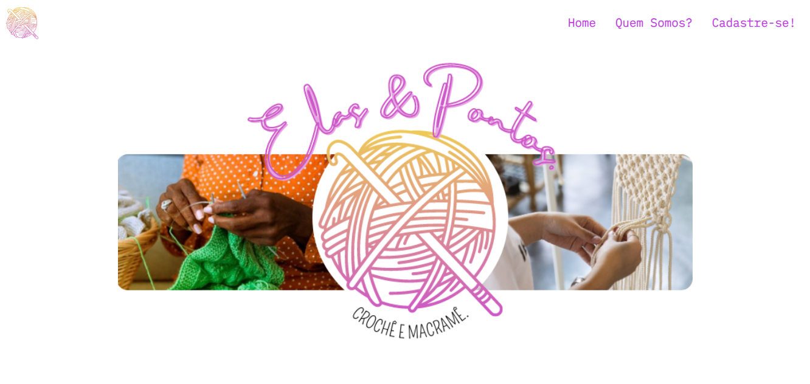
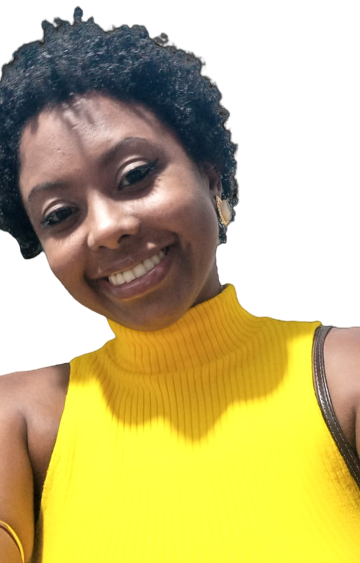
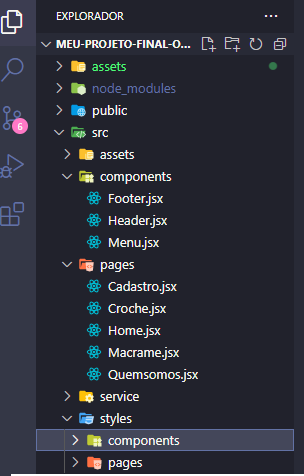

# Projeto-Final-Reprograma

<h1  align="center">

 

</h1>

## Apresentação

### Quem é a Náira Nogueira? 

 

[Náira Nogueira](https://www.instagram.com/naira.nog/), tenho 28 anos, sou formada em Língua Portuguesa pela Universidade do Estado da Bahia, oriunda de uma pequena cidade do interior da Bahia, chamada Governador Mangabeira, conheci a Reprograma através de uma amiga que já tinha feito o curso de Front-End. Buscando estabilidade financeira e um novo objetivo de vida, 
entrei no mundo da Tecnologia sem nunca ter tido contato com o mais simples desenvolvimento de códigos, hoje tenho conhecimentos básicos sobre html, css, JS, React, Git Bash e Github.

#### Contatos

-  [E-mail](naira.nogueira24@gmail.com) 

-  [LinkedIn](https://www.linkedin.com/feed/) 

-  [GitHub](https://github.com/Nairanogueira)  

## Conhecendo o PROJETO (Elas&Pontos.)

### 🧠 Contexto

O intuito de ajudar mulheres negras e/ou pobres que trabalhem com o artesanato e estejam precisando impulsionar as suas vendas, este website é desenvolvido para divulgar esses trabalhos de forma totalmente gratuita.

### O site conterem 5 páginas:

* Home
* Quem somos?
* Cadastre-se!
* Crochê
* Macramê

### Todas as páginas terão os componentes:

* Menu
* Header
* Footer

## Estrutura do projeto

 

 

##  `Tecnologias que utilizei` 

| Ferramenta | Descrição |

| `ReactJS` | Framework web |

| `Vite` | Gerador de projeto de front-end |

| `npm` | Gerenciador de pacotes |

| `Module CSS` | Ferramenta para ter mais produtividade ao estilizar a aplicação |

| `React router dom` | Dependência para criar rotas no reactjs |

| `Netlify` | Hospedagem para a aplicação, fiz o deploy integrado com o github |

| `Github` | Hospedagem do código fonte integrado com gerenciador de versionamento |

 

###  `Como rodar o projeto localmente` 

Siga os passos e inclua as informações abaixo:

|&nbsp;&nbsp;&nbsp;&nbsp; Passo &nbsp;&nbsp;&nbsp;&nbsp;&nbsp;| &nbsp;&nbsp;&nbsp;Comando/informação &nbsp;&nbsp;&nbsp;|

| Faça o fork | `botão de forkar` |

| Faça o clone | `git clone` |

| Instale as dependências após acessar a pasta projeto | `npm i` |

| Rode o projeto | `npm run dev` |

 

## 💪 Desafios 

- Maior desafio desse projeto: Meu maior desafio nesse projeto, foram todos na verdade kkk, mas mexer com a parte de JavaScript foi muito desafiador, desde do inicio das aulas de JS me senti um peixinho fora d'água. Tive dificuldades menores, mas não menos importante, na parte criativa mesmo, quantas páginas o site iria ter, quais cores usar, qual o nome do site, quais ferramentas utilizar, etc.

- Outro desafio foi acreditar mais em mim, o tempo corrido e controlar a ansiedade e o nervosismo.

## 💪 Aprendizados

- Meu aprendizado nesse projeto: Aprendi a instalar o sistema React-JS, a criar componentes maiores e componentes meneros, aprendi a importar corretamente os arquivos, a usar as tecnologias HTML, CSS E JS em conjunto, aprendi a criar variáveis, a usar o "map" em uma lista, o input, etc.  

- E outro aprendizado foi confiar mais em mim, entender que o meu processo é unicamente meu e me comparar com os outros só me atrapalha e me deixa frustada. Meu parâmetro de comparação deve sempre ser eu mesma! 

## Problema 

- Como criar meios de ajudar mulheres que buscam impulsionar seus trabalhos artesanais que na atualidade são desvalorizados através da tecnologia?

## Hipótese 

- Adentrando o mundo das tecnologias com a criação de website que tenha o intuito de divulgar trabalhos artesanais de mulheres que estejam em vulnerabilidade social de forma gratuita e objetiva. 

## Objetivos

`1`	Ajudar mulheres que não tenham alcance ao mundo das tecnologias;

`2`	Contribuir para a ascensão social e financeira dessas mulheres;

`3`	Site com grande poder de divulgação.

## Agradecimentos

Quero agradecer ao SANTANDER por ter patrocinado o curso de Front-end, agradeço a toda a equipe da {REPROGRAMA}, em especial à nossa facilitadora a Mari, a todas as professoras, a Thi, nossa primeira, a Rocks, a Ana e a Lilit, todas tem um espeço especial nesse processo de aprendizagem. Quero agradecer também a Ju,a Liana, a nossa lider técnica Paulinha e a todas as minhas parceiras/colegas de turma, sempre muito unidas, sem elas com certeza eu não teria concluído mais essa etapa. Sim! Epata! Porque tenho muito caminho pela frente! Continuo agradecendo também a minha família, pai, mãe, irmãos, tia, esposo e amigos, em especial ao casal Rai e Diego, que me ajudaram diretamente ou indiretamente nessa jornada. Sempre serei grata! Muito Obrigada!<3'
